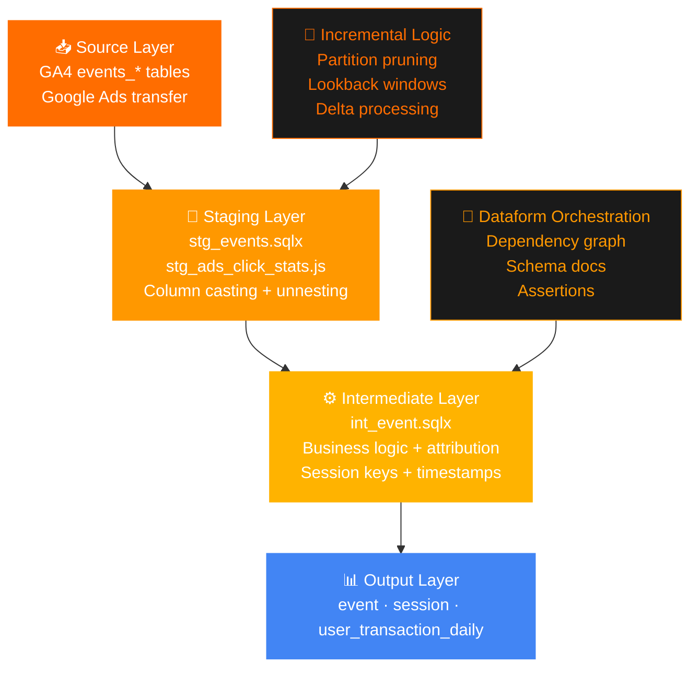

<div align="center">


<br/>

[](https://github.com/yashxsainix/ga4_dataform_pipeline)

<br/>

[](https://cloud.google.com/bigquery)
[](https://cloud.google.com/dataform)
[](https://cloud.google.com/bigquery/docs/reference/standard-sql)
[](https://ads.google.com)
[](LICENSE)

<br/>


</div>

---

## 🧠 The Problem

GA4 exports a massive volume of nested, semi-structured event data into BigQuery. It is powerful but almost unusable in its raw form.

Every query requires unnesting arrays. Every session must be reconstructed from individual events. Traffic source logic is incomplete — GA4 credits direct sessions even when a meaningful prior channel exists. Marketing teams end up rebuilding the same logic in every report, inconsistently.

This project solves that once, correctly, in a reproducible pipeline.

---

## 🏗️ Architecture



---

## ⚡ What This Pipeline Produces

<details>
<summary><b>📊 event — Event-level attribution table</b></summary>

One row per GA4 event, enriched with attribution-ready fields.

- Carries forward **last non-direct traffic source** when current session is direct
- Unnested event parameters: `ga_session_id`, `page_location`, `engagement_time_msec`, `gclid`
- Full cross-channel, SA360, CM360, and DV360 campaign fields
- Partition by `event_date`, clustered by `user_pseudo_id` and `ga_session_id`

</details>

<details>
<summary><b>📊 session — One row per user session</b></summary>

Session-level model for traffic source analysis and engagement reporting.

- Groups events into sessions with start time, engagement time, and session flag
- Applies **last non-direct attribution** at the session level
- Outputs `session_start_date`, `session_engaged`, `engagement_time_seconds`
- Ready for Looker Studio, Tableau, or Power BI connection

</details>

<details>
<summary><b>📊 user_transaction_daily — Purchase tracking by user</b></summary>

Ecommerce model aggregating purchase and refund metrics by user and date.

- Disabled by default — enable when `events` table contains purchase events
- Useful for cohort revenue analysis and LTV modeling

</details>

---

## 🔑 Key Business Logic

### Last Non-Direct Attribution
```sql
-- If current session is direct or source is missing,
-- look back to the most recent meaningful channel touchpoint
-- rather than crediting (direct) / (none) by default
```
This is one of the most misunderstood parts of GA4 reporting. Direct attribution inflates when users bookmark a site or type the URL. This model corrects that — giving credit to the channel that actually influenced the visit.

### Paid Traffic Source Correction
GA4 traffic source fields are incomplete when `gclid`, `gbraid`, or `wbraid` are present but campaign labels are missing. This pipeline detects Google Ads click identifiers and optionally joins Ads transfer data to recover campaign names.

### Incremental Processing
```sqlx
config {
  type: "incremental",
  bigquery: {
    partitionBy: "event_date",
    clusterBy: ["user_pseudo_id", "ga_session_id"]
  }
}

-- Only process new records + 3-day lookback
-- No full table rebuilds on daily runs
```

---

## 🗂️ Repository Structure

```
ga4_dataform_pipeline/
│
├── workflow_settings.yaml          ← GCP project, dataset config
├── includes/
│   ├── constants.js                ← Lookback windows, time zones, toggles
│   ├── helpers.js                  ← unnestColumn macro
│   └── non_custom_events.js        ← Standard GA4 event list
│
└── definitions/
    ├── sources/                    ← Raw table declarations
    │   ├── src_events.sqlx
    │   ├── src_ads_click_stats.js
    │   └── src_ads_campaign.js
    ├── staging/                    ← Column casting + unnesting
    │   ├── stg_events.sqlx
    │   └── stg_ads_*.js
    ├── intermediate/               ← Business logic + attribution
    │   ├── int_event.sqlx
    │   └── int_ads_click_campaign.js
    └── output/                     ← Reporting-ready tables
        ├── event.sqlx
        ├── session.sqlx
        └── user_transaction_daily.sqlx
```

---

## 🚀 Setup

**Option 1 — Dataform in Google Cloud Console**
```bash
# 1. Create a Dataform repository in GCP
# 2. Add these files to the repository
# 3. Update workflow_settings.yaml with your project and dataset names
# 4. Update includes/constants.js with your GA4 source dataset
# 5. Compile → Run
```

**Option 2 — Local Development**
```bash
npm install -g @dataform/cli
dataform init ga4_pipeline
# Replace definitions/ and includes/ with files from this repo
dataform compile
dataform run
```

**Required constants to configure:**
```javascript
// includes/constants.js
const SOURCE_DATASET = "your_ga4_dataset";
const REPORTING_TIME_ZONE = "America/New_York";
const START_DATE = "2024-01-01";
const GADS_GET_DATA = false; // set true to enable Google Ads join
```

---

## 💡 Business Questions This Answers

| Question | Output Table |
|---|---|
| Which channels drive the most engaged sessions? | `session` |
| What was the last meaningful channel before a direct conversion? | `event` |
| How do paid vs organic sessions compare in engagement? | `session` |
| Which campaigns influence conversions through multi-touch paths? | `event` |
| What is daily purchase revenue by user cohort? | `user_transaction_daily` |

---

## 👤 Author

**Yashpal Saini** · [LinkedIn](https://linkedin.com/in/yash-saini-analyst) · [Portfolio](https://yashxsainix.github.io)


